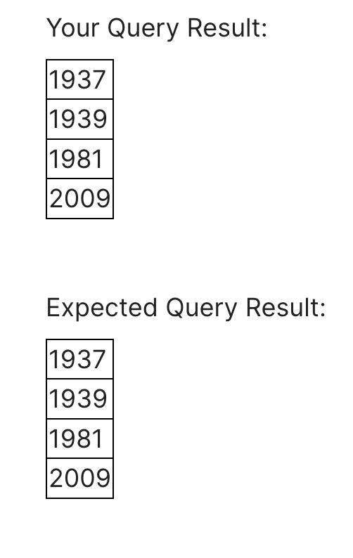
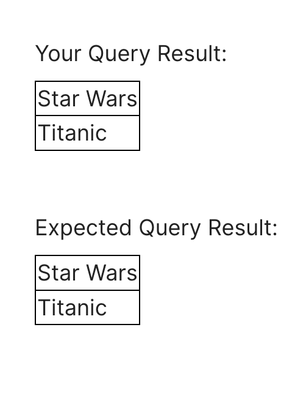
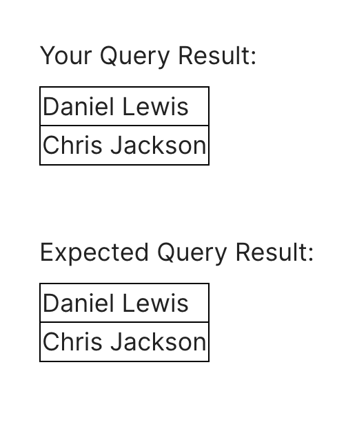
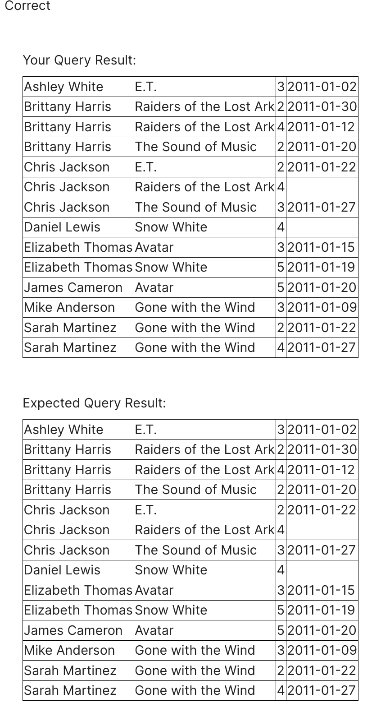
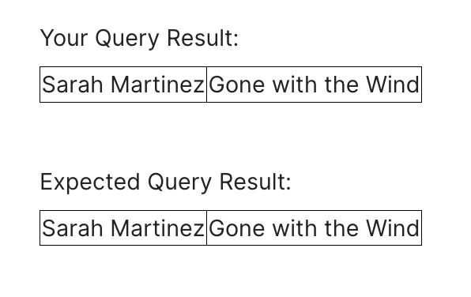
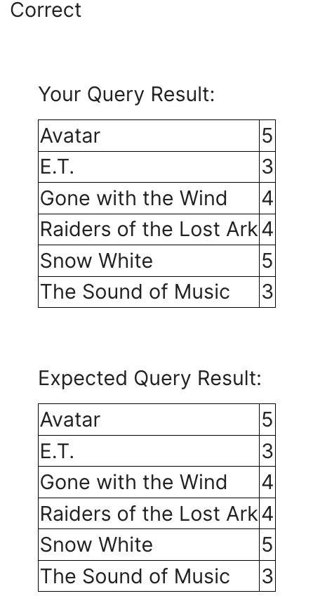
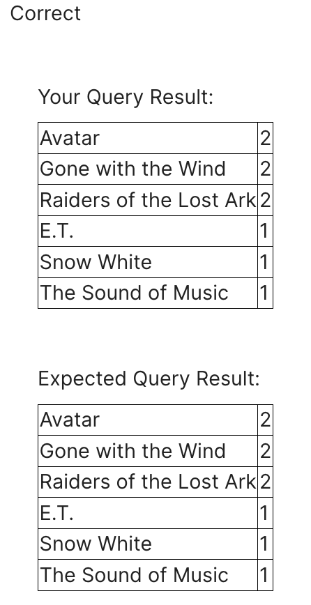
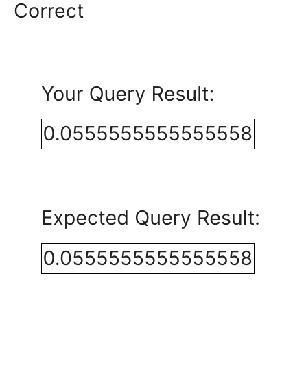

1. Find the titles of all movies directed by Steven Spielberg.

```sql
SELECT title
FROM Movie
WHERE director="Steven Spielberg";
```


2. Find all years that have a movie that received a rating of 4 or 5, and sort them in increasing order.

```sql
SELECT distinct(M.year)
FROM Movie M, Rating R
WHERE R.mID=M.mID and R.stars >= 4
ORDER BY year asc;
```


3. Find the titles of all movies that have no ratings.

```sql
SELECT M.title
FROM Movie M
WHERE M.mID not in (SELECT R.mID 
				  FROM Rating R);
```


4. Some reviewers didn't provide a date with their rating. Find the names of all reviewers who have ratings with a NULL value for the date.

```sql
SELECT R.Name
FROM Reviewer R
WHERE R.rID in(SELECT RA.rID
				FROM Rating RA
				WHERE RA.ratingDate is NULL);
```


5. Write a query to return the ratings data in a more readable format: reviewer name, movie title, stars, and ratingDate. Also, sort the data, first by reviewer name, then by movie title, and lastly by number of stars.

```sql
SELECT R.name, M.title, RA.stars, RA.ratingDate
FROM Reviewer R, Movie M, Rating RA
WHERE R.rID=RA.rID and RA.mID=M.mID
ORDER BY R.name, M.title, RA.stars;
```


6. For all cases where the same reviewer rated the same movie twice and gave it a higher rating the second time, return the reviewer's name and the title of the movie.

```sql
SELECT R.name, M.title
FROM Rating R1 Inner Join Rating R2 on R1.rID = R2.rID and R1.rID = R2.rID
Inner Join Reviewer R on R1.rID = R.rID
Inner Join Movie M on R1.mID = M.mID
WHERE R1.mID = R2.mID and R1.ratingDate > R2.ratingDate and R1.stars > R2.stars;
```


7. For each movie that has at least one rating, find the highest number of stars that movie received. Return the movie title and number of stars. Sort by movie title.

```sql
SELECT M.title, max(RA.stars)
FROM Movie M Inner Join Rating RA on M.mID=RA.mID
Inner Join Rating RA2 on RA.mID = RA2.mID
GROUP BY M.title 
HAVING count(RA.stars) > 1
ORDER BY M.title asc;
```


8. For each movie, return the title and the 'rating spread', that is, the difference between highest and lowest ratings given to that movie. Sort by rating spread from highest to lowest, then by movie title.

```sql
SELECT M.title, MAX(RA.stars)-MIN(RA.stars) as RS
FROM Rating RA Left Join Movie M on RA.mID=M.mID
GROUP BY M.title
order by RS desc, M.title;
```


9. Find the difference between the average rating of movies released before 1980 and the average rating of movies released after 1980. (Make sure to calculate the average rating for each movie, then the average of those averages for movies before 1980 and movies after. Don't just calculate the overall average rating before and after 1980.)

```sql
SELECT AVG(movieAVG_b1980)-AVG(movieAVG_a1980)
FROM (
SELECT AVG(R.stars) as movieAVG_b1980
FROM Rating R, Movie M
WHERE M.year < 1980 and R.mID=M.mID
GROUP BY M.title), ( 
SELECT AVG(R.stars) as movieAVG_a1980
FROM Rating R, Movie M
WHERE M.year > 1980 and R.mID=M.mID
GROUP BY M.title);
```


